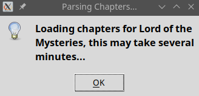
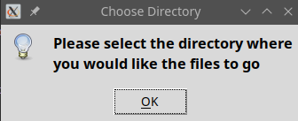
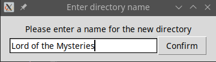
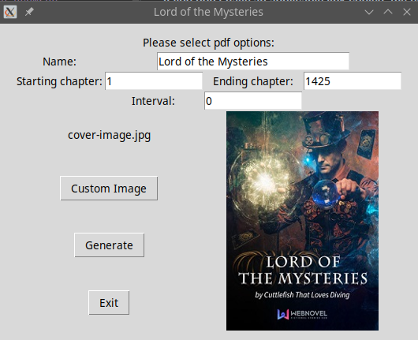
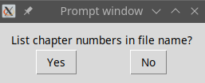
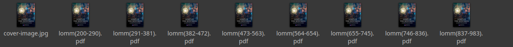
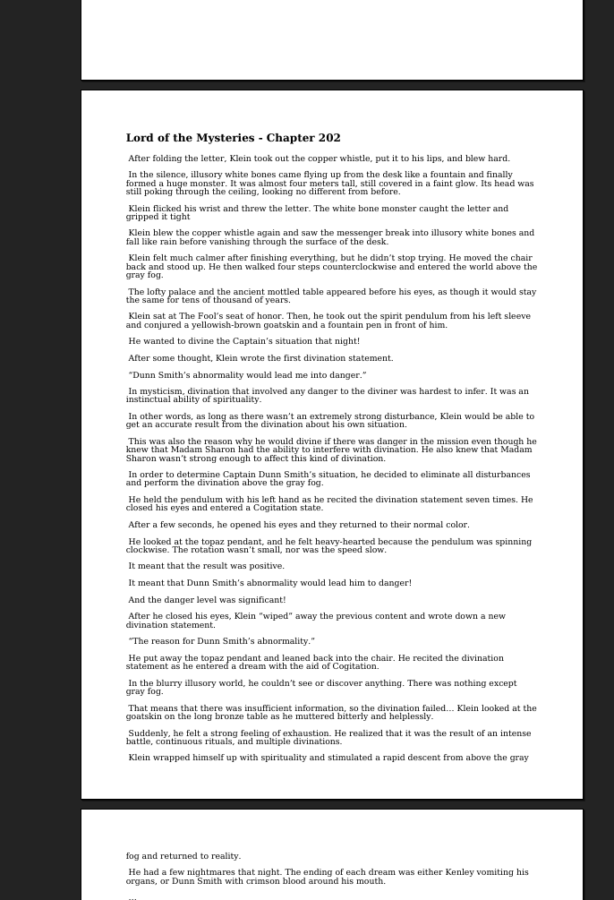

# Novel 2 PDF
### Simple Tk GUI online novel downloader
***
### NOTE: This is made for educational purposes, I do not condone the pirating of works from congregate sites

## Basic Info:
***

##### Basic PDF generator based on box-novel.com (for no particular reason) I may eventually expand on this, but in order for it to work fast, it's not easy to make it work with different sites

Currently the generated PDF is not very dynamic, the parameters are strict for a reason, but you can change the font in most PDF readers

The GUI is simple and based on Tkinter, I didn't feel it was necessary to use PyQt for a small project like this

Naturally anything I've hard-set in the code can be changed manually by you, namely the font, though it is required to be unicode

This is hypothetically meant to be used through a keyboard shortcut by simply copying the link, though currently the code is not running well from the command line, this will be the first fix I make.

## Example Usage:
***

_**For this example I'm going to be using Lord of the Mysteries**_

*Link: https://www.box-novel.com/novel/lord-of-the-mysteries-2/*

#### Assuming you have an applicable link copied to your clipboard, you should see a prompt that the link is being scraped

#### If you don't have an applicable link copied, the program will open box-novel.com on a previous instance of your default web browser

#### You will be prompted to select a filepath

#### And then to name the new directory, this will default to the name of the novel

#### Finally you can select the starting and ending chapters of the PDF(s) generated
These will default to 0 and the number of chapters scraped, any missing chapters are due to the website, not the code

#### Furthermore you can name the individual PDF(s), if you are generating more than one pdf they will be numbered by chapter #s by default
#### The interval allows you to generate multiple PDFs with each containing that number, rounding up on the final PDF.
This is useful if your pdf reader or tts can't handle a trillion pages
#### If you do not like the image or resolution generated, you can upload your own cover image file png or jpg file, however there is a strict file typing, if this isn't working you can check the console output to see the true file format, it is likely the extension is not the actual format.
This will automatically resize that image, the preview should be representative of the formatting of the final image, though it may seem better quality because of the higher pixel density from the smaller image. The image that is scraped from the congregate website, for example, has a low resolution and will look very pixelated as a cover image. 

#### Once your parameters are set, click the generate button and your PDF(s) will be generated to the directory you chose
Assuming you are only generating 1 pdf, you will be prompted to include the chapter #s, in case you're only generating a certain number of chapters

#### Finally you will be prompted to convert more from the given link
For example if you want different covers for different sections, and/or different names or a non-linear gap between different files, to name a few examples.

#### Output:

As you can see in the directory is the cover image from the website along with files generated from chapters 200 - 983 with a 90 chapter interval, the last file rounds up from 837-983

Random formatted page for reference

#### Also included is the cover page at the start along with a lengthy table of contents

Eventually I will add options such as font size, import font, disable table of contents, text only cover and such, if I feel like it.

## Additional Info:
***

#### License: MIT
#### Dependencies:
* pandas
* easygui
* fpdf
* pyperclip
* httpx
* bs4
* requests
* PIL
#### If you've read this far please go read lord of the mysteries it's so good istg